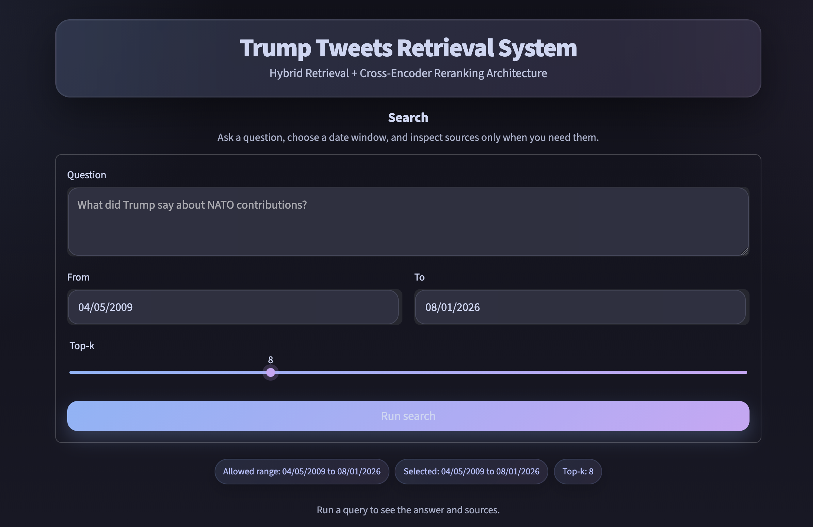

# RAG Trump Twitter Posts

    HSE Research Seminar: AI and Data Analysis  
Source: [Kaggle dataset](https://www.kaggle.com/datasets/datadrivendecision/trump-tweets-2009-2025/data)

Twitter & Truth gSocial, 2009–2026



Небольшое RAG-приложение для поиска по архиву постов Дональда Трампа.

Проект умеет:
- искать релевантные посты по гибридной схеме: dense retrieval + BM25 + rerank;
- фильтровать результаты по дате;
- показывать найденные источники;
- генерировать итоговый ответ через OpenRouter;
- запускаться через Streamlit UI

В репозитории уже есть очищенный датасет: `data/processed/trump_tweets_clean.csv`.

## Архитектура

`BAAI/bge-m3` retrieval → fusion → deduplication → reranking (`cross-encoder/ms-marco-MiniLM-L-6-v2`) → generation (`arcee-ai/trinity-large-preview:free`)

## Структура проекта
```text
rag-trump-twitter/
├── .streamlit/                   # настройки Streamlit для Docker/Spaces
│   └── config.toml
├── data/                         # папка с исходными и подготовленными данными
│   ├── processed/
│   └── raw/
├── ingest/                       # загрузка, очистка и подготовка твитов
│   ├── clean_tweets.py
│   ├── load_tweets.py
│   └── run_cleaning.py
├── rag/                          # логика RAG: поиск, реранкинг и генерация ответа
│   ├── dedupe.py
│   ├── embeddings.py
│   ├── generator.py
│   ├── prompts.py
│   ├── query_utils.py
│   └── retriever.py
├── .dockerignore                 # что не копировать в Docker image
├── .env.example                  # пример файла с переменными окружения
├── .gitignore
├── .python-version
├── Dockerfile                    # сборка контейнера для Hugging Face Space
├── README.md                     # сверху должен быть YAML-блок для HF Space
├── app.py                        # запуск интерфейса приложения
├── build_index.py                # построение основного поискового индекса
├── build_term_expansion_index.py # построение индекса для term expansion
├── config.py                     # настройки моделей и параметров пайплайна
├── main.py                       # основной файл запуска
├── pyproject.toml                # зависимости проекта и его конфигурация
└── uv.lock                       # зафиксированные версии зависимостей
```

## Стек

* Python 3.11+
* uv
* Streamlit
* pandas / numpy
* FlagEmbedding (BGE-M3)
* rank-bm25
* sentence-transformers / transformers
* OpenRouter

## Установка и запуск

```bash
uv venv
source .venv/bin/activate
uv sync
cp .env.example .env
```

Укажите в `.env`:

```env
OPENROUTER_API_KEY=your_key_here
HF_TOKEN=your_key_here
```

Построение индекса:

```bash
uv run python build_index.py
```

Запуск приложения:

```bash
uv run streamlit run app.py
```

## Важно

При первом запуске проект скачивает модели и строит индекс, поэтому старт может занять время.

```text
vectorstore/hybrid_index
```